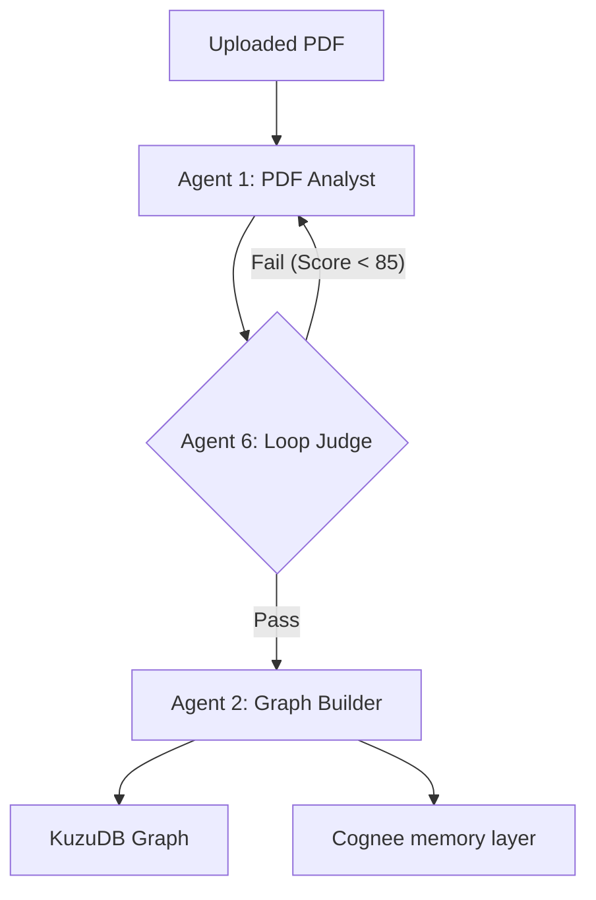

# 🧠 PaperMind

PaperMind is a **living research knowledge graph** that extends the [Agents-K1](https://arxiv.org/abs/2606.13669) paper (arXiv:2606.13669) with personalized interactive exploration. While Agents-K1 demonstrates the power of Graph-over-RAG at scale (2.46M papers), PaperMind is the interactive, user-facing research platform that empowers individual researchers and small labs.

---

## ✨ Core Innovations & Contributions

PaperMind goes beyond typical retrieval architectures by introducing three key mathematical/logical contributions:

| Contribution | Metric / Formula | Description |
| :--- | :--- | :--- |
| **Living Graph Update** | $\Delta(G_u, p)$ | Retroactively enriches existing graph nodes, citations, and claim weights when a new paper $p$ is ingested. |
| **Corpus-Scoped Retrieval** | $K_{\text{fused}}(q, G_u)$ | Fuses semantic vector embeddings with local knowledge graph context to personalize search to your private research library. |
| **Research Gap Score** | $\text{RGS}(v)$ | A formal metric ranking identified research gaps by citation strength, contradiction density, and semantic novelty. |

---

## 🛠️ Technology Stack

- **Large Language Model**: Qwen3:32B via OpenRouter (`qwen/qwen3-32b`) for agent reasoning, analysis, and validation.
- **Memory & Storage**: **Cognee** (handles vector search, hybrid retrieval, and delta graph consolidation via `remember`, `memify`, and `recall`).
- **Graph Database**: **KuzuDB** (embedded in-process graph database for high-performance Cypher queries).
- **Backend Service**: **FastAPI** + **Celery** (async task queues) + **Redis** (message broker).
- **Frontend App**: **Next.js** + **Cytoscape.js** (for dynamic, interactive graph visualization).
- **PDF Parser**: **MinerU** (with PyMuPDF fallback for structural text, figures, equations, and tables).

---

## 📁 Repository Structure

```text
papermind/
├── agents/                  # Multi-Agent orchestrators (PDF Analyst, Graph Builder, Query Agent, Gap Agent)
├── api/                     # FastAPI endpoint routers (papers, query, graph, websockets)
├── core/                    # Core orchestration loop, client wrappers (Cognee, Kuzu, OpenRouter), and RGS logic
├── docs/                    # Detailed technical specifications and architecture docs
│   ├── agents.md            # Detailed prompt specifications for all agents
│   ├── architecture.md      # Backend/database schemas and system layout
│   ├── cognee_role.md       # Integration notes on Cognee's vector/graph operations
│   └── loop_flow.md         # Evaluator-optimizer self-correcting agent loop structure
├── frontend/                # Next.js web application with Cytoscape.js canvas
├── schema/                  # KuzuDB Cypher table schemas
├── tasks/                   # Celery asynchronous task definitions (paper ingestion, gap synthesis)
├── main.py                  # Backend server entry point
├── requirements.txt         # Python project dependencies
└── docker-compose.yml       # Dev/Deployment orchestration (Redis, Celery, etc.)
```

---

## 🚀 Quick Start & Installation

### 1. Prerequisites
- **Python 3.12.7** (recommended)
- **Node.js 18+** & npm/yarn
- **Redis** running locally (or via Docker)

### 2. Environment Configuration
Create a `.env` file in the root directory by copying the template:
```bash
cp .env.example .env
```
Ensure you provide your OpenRouter API key and configure paths:
```env
OPENROUTER_API_KEY=sk-or-your-api-key-here
COGNEE_DB_PATH=./cognee_db
KUZU_DB_PATH=./kuzu_graph
REDIS_URL=redis://localhost:6379
FRONTEND_URL=http://localhost:3000
```

### 3. Backend Setup
Create a virtual environment and install the required dependencies:
```bash
# Create and activate virtual environment
python -m venv .venv
source .venv/bin/activate  # On Windows: .venv\Scripts\activate

# Install requirements
pip install -r requirements.txt
```

Start the FastAPI application:
```bash
uvicorn main:app --reload --port 8000
```

Start the Celery worker (in a separate terminal):
```bash
celery -A tasks.celery_tasks worker --loglevel=info
```

### 4. Frontend Setup
Navigate to the frontend directory, install dependencies, and start the development server:
```bash
cd frontend
npm install
npm run dev
```
Open `http://localhost:3000` to view the user interface.

---

## 🔄 Multi-Agent Self-Correction Loop

PaperMind uses an **Evaluator-Optimizer** loop design. Outputs generated by the domain agents are scored by a **Loop Judge** (Agent 6) before persistence. If a validation threshold (0-100) is not met, the payload is rejected, and the worker re-runs the analyst agent with structured critique feedback, preventing dirty data from polluting the knowledge graph.



For a comprehensive breakdown of agent prompts, evaluation structures, and database schemas, please refer to the files in the [docs/](file:///c:/Users/arpan%20goyal/Desktop/PaperMind/docs/) directory.
